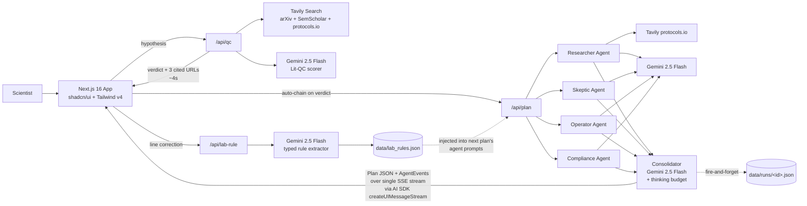

# Hack-Nation 5 — Sextant Submission Package

**Deadline:** 2026-04-26 09:00 ET
**Form:** [Hack-Nation submission portal — Submit New Project]
**Team ID:** HN-6672 (solo)

> Copy-paste sections below directly into the submission form. Pre-flight checklist at the bottom.

---

## Form: top-of-page metadata

| Field | Value |
|---|---|
| **Project Title** | Sextant — AI CRO Co-Pilot |
| **Event** | 5th-hack-nation |
| **Challenge** | 04 — Fulcrum Science: The AI Scientist |
| **Program Type** | (auto-fills after challenge select) |
| **Live Project URL** | https://sextant-uekv.vercel.app |
| **GitHub Repo URL** | https://github.com/yauhenifutryn/sextant ⚠ **flip to PUBLIC before submitting** |
| **Technologies/Tags** | TypeScript, Next.js 16, React 19, Vercel AI SDK v5, Gemini 2.5 Flash, Tavily, Multi-Agent, Structured Output, Tailwind v4, shadcn/ui, Framer Motion, Zod |
| **Additional Tags** | AI Scientist, CRO, Closed-Loop Learning, Grounded Generation, Provenance, B2B SaaS |

---

## Form: Short Description

> Sextant turns a scientific hypothesis into a fully-grounded experiment plan in 3 minutes — and every correction a scientist makes compounds into the next plan, automatically. An AI Operations Platform for the $100B Contract Research market.

---

## Form: Structured Project Description (6 required fields)

### 1. Problem & Challenge

Scoping a single CRO (Contract Research Organization) experiment takes 2-3 weeks of expert effort: literature review for novelty, protocol design from public methods, materials sourcing with real catalog numbers and prices, budget estimation, timeline, and compliance posture. CRO operators are bottlenecked on this scoping work, and the output is usually a static document that doesn't compound across projects. The Fulcrum brief asks for an AI Scientist that generates fundable, *executable* plans — not chat replies. The hard part isn't generating text; it's producing a queryable typed artifact a CRO operator can dispatch, with every claim verifiable to a real source.

### 2. Target Audience

Contract Research Organization (CRO) operators, principal investigators at biotech startups, and academic lab managers planning grant-funded studies. Specifically: the person who has to turn a research idea into a 1-week-shippable experiment with real materials, real costs, and real regulatory posture. Today they spend weeks gathering inputs and lose institutional knowledge every time a scientist leaves. Sextant captures both the plan AND the corrections that improve it.

### 3. Solution & Core Features

Sextant is a chat-driven web application that runs four cooperating AI agents in parallel — Researcher, Skeptic, CRO Operator, Compliance — and produces a structured 5-section experiment plan (Protocol, Materials, Budget, Timeline, Validation) in under a minute. Core features:

- **Literature QC** — Tavily search across arXiv, Semantic Scholar, and protocols.io produces a novelty verdict with 3 cited references in under 4 seconds.
- **Multi-agent plan generation** — Four agents fan out in parallel, each owns one slice of the plan, a fifth consolidator merges. Live trace rail shows each agent's role and current task.
- **Grounded typed artifact** — Every reagent, every catalog number, every protocol step carries a clickable citation. Hard rule: no claim ships without a verifiable URL.
- **Closed-loop corrections** — Click any plan line, submit a correction. The system extracts a typed lab rule (not freeform text) into a JSON store.
- **Propagation demo** — Submit a second hypothesis and the new plan visibly applies the previously-captured rules without re-prompting. A side-by-side diff modal labels each changed line with the rule that was applied.

### 4. Unique Selling Proposition (USP)

We're not another GPT wrapper. The differentiator lives in three places:

1. **Typed lab-rule artifact + closed loop** — Every scientist correction extracts a typed, queryable rule into that lab's private store. Over months of real CRO usage, the rule store becomes a private asset competitors can't replicate. This is data network effects at the lab-tenant level — the actual moat for v2 of the product.
2. **Grounded-typed-artifact contract** — ChatGPT writes prose. Sextant produces a queryable Plan JSON with `citations: Citation[]` per line, a `grounded` provenance flag, and a 5-section schema a CRO operator can act on. The provenance discipline (no claim without verifiable URL, post-stream provenance check, repair callbacks) is regulated-domain trust posture model labs won't ship by default.
3. **Domain-calibrated multi-agent roles** — Researcher / Skeptic / CRO Operator / Compliance encode CRO workflow assumptions a generic chat doesn't. Replaceable in isolation; valuable when calibrated against real CRO feedback over time.

The hackathon ships the prototype that proves the closed loop *can* close. The investment thesis is scaling the closure.

### 5. Implementation & Technology

TypeScript-only monorepo. **Stack:** Next.js 16 App Router on Node 20, Tailwind v4 (CSS-first `@theme`), shadcn/ui, Framer Motion, Lucide icons. **AI orchestration:** Vercel AI SDK v5 (`ai`, `@ai-sdk/google`, `@ai-sdk/react`) for streaming, structured output with Zod, multi-step agent loops, and `createUIMessageStream` for the per-agent trace event channel. **Models:** Gemini 2.5 Flash via `@ai-sdk/google` for all 5 agent calls, with a runtime fallback ladder (preview → 2.5-flash → 2.0-flash) and a 60-second probe cache that handles preview-tier flapping without restarting the route. **Grounding:** Tavily API for literature search and supplier scraping. **Storage:** JSON files in repo (`data/runs/<id>.json` for plans, `data/lab_rules.json` for the rule store) — no database. **Hosted:** Vercel free tier, auto-deploy on push to main, ~30s deploys. **Architecture highlights:** the 4-agent pipeline runs as parallel `streamObject` calls via `Promise.all`; per-agent lifecycle events (`started` / `working` / `done` / `error`) ride the same SSE stream as the Plan via AI SDK custom data parts. Lab rules are extracted into a typed Zod schema via a dedicated Gemini call, persisted to disk, and injected into agent prompts on the next hypothesis. End-to-end response time on a fresh run: ~45 seconds from chip click to consolidated plan painted into the canvas.

### 6. Results & Impact

Built solo in 24 hours. **Live demo flow:** chip-click hypothesis → grounded literature verdict with 3 cited URLs (3.8s wallclock cache-miss, 65ms cache-hit) → 4 agents fan out in parallel in the trace rail → consolidated experiment plan paints into a 5-tab canvas with Protocol, Materials, Budget, Timeline, and Validation sections (~45s end-to-end) → user clicks any plan line, submits a correction → typed lab rule extracted and persisted → second hypothesis submitted → new plan visibly applies the rule, surfaced in a side-by-side diff modal. **Real-world impact:** turns 2-3 weeks of CRO scoping work into 3 minutes, and — uniquely — every correction makes the system smarter for that lab's specific domain. The closed loop is the differentiator: every scientist interaction compounds into compounding institutional value. Anti-claim: this is the prototype, not proof of moat. Real defensibility takes months of real CRO usage. The pitch is "watch the loop close in 60 seconds; the investment thesis is scaling the closure."

---

## Form: Additional Information (optional)

**Why this matters for the broader AI ecosystem:** Sextant is a working example of the YC AI-native principles in a regulated B2B domain — closed loops over open loops, queryable typed artifacts over free text, multi-agent orchestration with cited provenance, no human middleware in the UI. The same architecture pattern (typed-artifact + closed-loop correction + propagation) generalizes beyond CRO scoping to any domain where expert corrections currently die in tribal knowledge: legal contract review, insurance underwriting, regulatory filings, accounting close-out.

**Honest limits:** Built solo in 24 hours. The lab rule store is seeded with 3-5 demo rules; real defensibility requires months of real-lab usage. Real ELN/LIMS/procurement integrations, multi-tenancy, and regulatory audit logs are roadmap items, not shipped features. The Phase 7 propagation demo is the moat-validation evidence — without it the project would reduce to another GPT wrapper.

---

## Demo Video (60s, max) — UI/UX showcase

### Cache-warming protocol (run 5 minutes before recording)

1. Open https://sextant-uekv.vercel.app/app in the browser you'll record.
2. Click chip H1 (CRP biosensor) → wait for verdict + plan to fully stream → leave the page open.
3. Open a second tab on the same URL → click chip H2 (the second pre-staged hypothesis we'll demo for propagation) → wait for verdict + plan.
4. Back on tab 1 (H1's plan): click any Materials row → "Correct" → submit a 1-line rule. Wait for "Lab rule saved" toast.
5. Back on tab 2 (H2): re-click chip H2 → verify the diff modal opens showing the rule applied.
6. Now caches are warm: lit-QC for h1+h2, plan for h1+h2 (post-correction), lab_rules.json populated.
7. Close tab 2. Refresh tab 1 to a clean dashboard (caches survive refresh — they live in the route handler's module-level `Map`).
8. Begin recording.

### 60s shot list + narration

| Time | What's on screen | Narration (rehearsed) |
|---|---|---|
| 0:00-0:03 | Landing page, click "Open Sextant" | "Sextant turns a scientific hypothesis into a fundable experiment plan in 3 minutes." |
| 0:03-0:06 | Empty dashboard. Click chip H1. | "A scientist enters a hypothesis." |
| 0:06-0:10 | Verdict streams above canvas, 3 citation cards | "First, we ground it — Tavily searches arXiv, Semantic Scholar, and protocols.io. Verdict streams in under 4 seconds with cited references." |
| 0:10-0:25 | Trace rail: 4 agent rows light up in parallel — Researcher, Skeptic, Operator, Compliance — then the Consolidator. Plan paints into the canvas tabs. | "Then four agents debate in parallel — Researcher, Skeptic, CRO Operator, Compliance. A consolidator merges their work into a typed JSON plan with five sections: Protocol, Materials, Budget, Timeline, Validation." |
| 0:25-0:32 | Click Materials tab. Click a reagent row. Correction popover appears. Type "Always order from Sigma-Aldrich, never Thermo Fisher". Click Save. Toast: "Lab rule saved". | "Watch the closed loop. The scientist clicks any line, submits a correction. We extract it as a typed lab rule." |
| 0:32-0:50 | Click chip H2 (different hypothesis, same lab domain). Verdict streams. Plan generates. Diff modal opens automatically — left: original plan. Right: new plan with one line highlighted in clay/rust + label "Lab rule applied: Always order from Sigma-Aldrich". | "Submit a second hypothesis. The new plan automatically applies the rule — no re-prompting. The diff modal shows exactly which line changed and which rule fired." |
| 0:50-0:58 | Quick zoom on the diff highlight. Pan to the lab profile drawer showing the rule with usage count "Used in 1 plan". | "Every correction compounds. After months of real lab usage, this rule store becomes that lab's private operating intelligence." |
| 0:58-1:00 | Logo + tagline: "Sextant — AI Operations Platform for Contract Research." | (let the logo land) |

**Recording tips:**
- 1920×1080, 60fps if possible. Browser at 100% zoom.
- Use OBS or QuickTime. H.264 MP4. Target file size <30MB.
- Hide bookmarks bar, use a clean browser profile.
- Run a dry pass with a stopwatch before the keeper take. Two takes, pick the better one.
- If the trace rail animation ticks too fast (cache-hit makes agents flash done in milliseconds), use the demo-pace toggle Phase 6 will add (~3-5s artificial pacing per agent). Without that toggle, just slow the screen recording playback to 0.7× over the 0:10-0:25 segment in post.

### Fallback if Phase 7 didn't land in time

Cut the 0:25-0:50 segment to a single still frame: a Figma-drawn before/after comparison with the lab rule callout. Total demo shrinks to ~35s. Use the remaining 25s to narrate the closed-loop concept over the still. Less impressive but still honest.

---

## Tech Video (60s, max) — architecture + implementation

### Architecture diagram (Mermaid source — render at https://mermaid.live, screenshot at high resolution)

### 60s narration script (~145 words, ~58s spoken at conversational pace)

> Sextant is a TypeScript monorepo on Next.js 16, deployed to Vercel.
>
> The browser sends a hypothesis to slash-A-P-I-slash-Q-C, which fires a Tavily search across arXiv, Semantic Scholar, and protocols.io, scores novelty with Gemini 2.5 Flash, and streams a verdict with three cited URLs in under four seconds.
>
> That triggers slash-A-P-I-slash-plan, which fans out to four parallel Gemini calls — Researcher, Skeptic, C-R-O Operator, Compliance — using Promise.all. A fifth consolidator call merges them into a typed Plan JSON. Per-agent trace events ride the same S-S-E stream as the Plan, using the Vercel AI SDK's createUIMessageStream pattern.
>
> When the scientist corrects a line, slash-A-P-I-slash-lab-rule extracts a typed rule into a JSON store. On the next hypothesis, the agent prompts read that store — the new plan visibly applies the rules, surfaced in a diff modal.
>
> Hard rule: every claim cites a verifiable URL. No hallucinated catalog numbers. The closed loop is the moat.

### Tech video recording recipe

1. Render the Mermaid diagram at https://mermaid.live (paste source, click "Actions" → "PNG"). Save at 1920×1080 minimum.
2. In a slide tool (Keynote, Google Slides, Figma), put the diagram on a single slide with a subtle white-to-paper gradient background.
3. Optional polish: add a 4-stage build animation — appear (1) the QC path, (2) the 4 parallel agents, (3) the consolidator + stream, (4) the lab rule loop. Each stage cued to the narration.
4. Record screen + voiceover in QuickTime or OBS. Same MP4 spec as the demo video.
5. If you're tight on time, skip the build animation — narrate over the static diagram.

---

## Pre-flight checklist (do these BEFORE submitting)

- [ ] **Flip GitHub repo to PUBLIC** — currently private per STATE.md. Required for submission archive.
- [ ] Verify https://sextant-uekv.vercel.app responds and the full demo flow works end-to-end (lit-QC + plan + correction + propagation).
- [ ] Cache-warm 4 demo chips, then record demo video.
- [ ] Render architecture diagram (mermaid.live → PNG) and record tech video.
- [ ] Both videos: H.264 MP4, max 60s each, target <30MB each.
- [ ] Team photo: solo team — one landscape photo, good lighting, face centered. 16:9 ratio recommended.
- [ ] Copy-paste all 6 structured description fields from this doc into the form.
- [ ] Confirm consent checkbox.
- [ ] Add team members if any (currently 0/4 — solo).
- [ ] Click submit. Take a screenshot of the confirmation page.

---

## What I'm NOT shipping for the submission (cuts already approved)

- No pitch deck (the structured 6-field description IS the deck).
- No automated end-to-end demo dry-run (manual UAT only — 2 dry passes, then record).
- No additional screenshots beyond the 2 videos (Media Gallery: just the team photo + the 2 videos = 3 of 8 slots used).
- No PDFs / posters / ZIPs in the gallery.
- Optional Live Project URL is filled (Vercel deploy).

---

*Drafted: 2026-04-26 ~03:30. Update as we get closer to submission. The structured description fields will likely need a 1-pass tightening once Phase 7 is verified live.*
