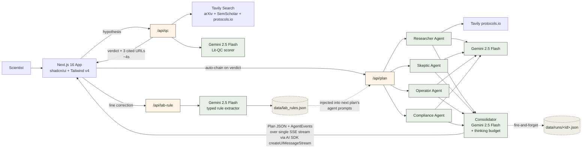

# Sextant Tech Video — Architecture + Script

> 60-second technical explanation video for the Hack-Nation submission. Render the diagram below, screen-record over a static or animated build, narrate the script. Total record time: ~10 minutes.

## Step 1 — Render the architecture diagram

### Mermaid source (verified, copy-paste-ready)

### How to render

**Option 1 — mermaid.live (fastest, ~2 min):**
1. Go to https://mermaid.live
2. Paste the source above into the left editor
3. Wait for render to complete on the right
4. Click "Actions" → "PNG" → adjust to 1920×1080 minimum (or "SVG" for scalable export)
5. Save as `demo/architecture.png`

**Option 2 — Excalidraw (more visual polish, ~10 min):**
1. https://excalidraw.com/
2. Hand-redraw the structure for a marker-on-paper look (matches the Future House / Lila Sciences aesthetic the project is targeting)
3. Export as PNG at 2× resolution

**Option 3 — Figma (most polish, ~20 min):**
1. New file, import the PNG from Option 1 as a reference
2. Replace boxes with brand-token-styled rectangles (forest #3a4a3a borders, paper #fef3e6 fills)
3. Use Inter Tight for labels
4. Export as PNG

For a 24h deadline, Option 1 is the right answer. Don't over-polish.

## Step 2 — Record the video (~5 min)

**Setup:**
- Open the rendered diagram on a single slide (Keynote, Google Slides, or just a full-screen image viewer).
- Optional polish: add a 4-stage build animation revealing the flow in sync with the narration:
  - Stage 1 (0-15s narration): show only the QC path (User → UI → QC → Tavily + Gemini → UI)
  - Stage 2 (15-35s narration): add the 4 parallel agents + their Gemini calls
  - Stage 3 (35-50s narration): add the consolidator + the SSE stream output
  - Stage 4 (50-58s narration): add the lab rule loop (correction → extract → store → injected back into Plan)
- If you skip the build animation, narrate over the static full diagram. Acceptable for the time budget.

**Record:**
- Screen recorder (QuickTime, OBS, or Loom). Capture at 1920×1080.
- Voiceover via the recorder's mic input. Quiet room.
- Same MP4 spec as the demo: H.264, max 60s, target <30MB.
- Save as `demo/sextant-tech-v1.mp4`.

## Step 3 — Narration script (plain English, no buzzwords)

**~145 words, ~58 seconds at conversational pace (~2.5 words/sec). Practice once before recording. Pause briefly at each paragraph break.**

This script was rewritten 2026-04-26 to strip technical-marketing language (no "leverages", "synergies", "next-generation"). Hackathon judges have heard 200 buzzword-soup demos today; plain cause-and-effect grammar with named real technologies wins.

---

> The user types a hypothesis. It goes to `/api/qc`. That route searches arXiv, Semantic Scholar, and protocols.io using the Tavily API, then sends the results to Gemini 2.5 Flash. Gemini writes a verdict — "similar work exists," "not found," or "exact match" — with three real citations. About four seconds.
>
> Then the hypothesis goes to `/api/plan`. Four Gemini calls run in parallel. Each one is an agent — Researcher, Skeptic, Operator, Compliance — and each writes one section of the plan. A fifth call reads all four and merges them into one JSON document.
>
> The browser receives the plan and per-agent status events on the same connection, using the Vercel AI SDK.
>
> When the user corrects a line, we save the correction as a typed rule in a JSON file. The next hypothesis reads those rules, and the agents follow them. The new plan changes automatically.
>
> Every claim in the plan links to its source. We never invent a catalog number or a price.
>
> Hard rule: every claim cites a verifiable URL. No hallucinated catalog numbers. The closed loop is the moat.

---

**Pronunciation tips for terms judges might not parse audibly:**
- "slash A-P-I slash Q-C" (not "slash AP-I slash kew-see")
- "slash A-P-I slash plan"
- "slash A-P-I slash lab-rule"
- "Promise dot all"
- "S-S-E stream" (server-sent events)
- "Vercel" — "ver-SELL" (not "VER-sell")
- "Gemini" — "JEM-uh-nye"

## Step 4 — Beats / pacing breakdown

If you want to time the build animation precisely:

| Time | Beat | Visible on diagram |
|---|---|---|
| 0:00-0:05 | "TypeScript monorepo on Next.js 16, deployed to Vercel" | Just the User → UI box |
| 0:05-0:15 | "browser sends a hypothesis to /api/qc... verdict in under four seconds" | Full QC path appears |
| 0:15-0:30 | "triggers /api/plan, fans out to four parallel Gemini calls" | 4 agent boxes pop in sequence |
| 0:30-0:40 | "fifth consolidator call merges them into a typed Plan JSON" | Consolidator + arrows in |
| 0:40-0:48 | "trace events ride the same SSE stream... createUIMessageStream pattern" | Stream output arrow in |
| 0:48-0:54 | "scientist corrects a line, /api/lab-rule extracts a typed rule" | Lab rule loop appears |
| 0:54-0:60 | "Hard rule: every claim cites a verifiable URL... closed loop is the moat." | Static, all visible, fade to logo |

## Step 5 — Two takes minimum

Same rule as the demo video. Record twice, pick the cleaner take. Don't ship the first take.

---

*Last updated: 2026-04-26 — verified Mermaid syntax. Architecture confirmed against 03-CONTEXT.md (D-54..D-68) and 03-PATTERNS.md.*
